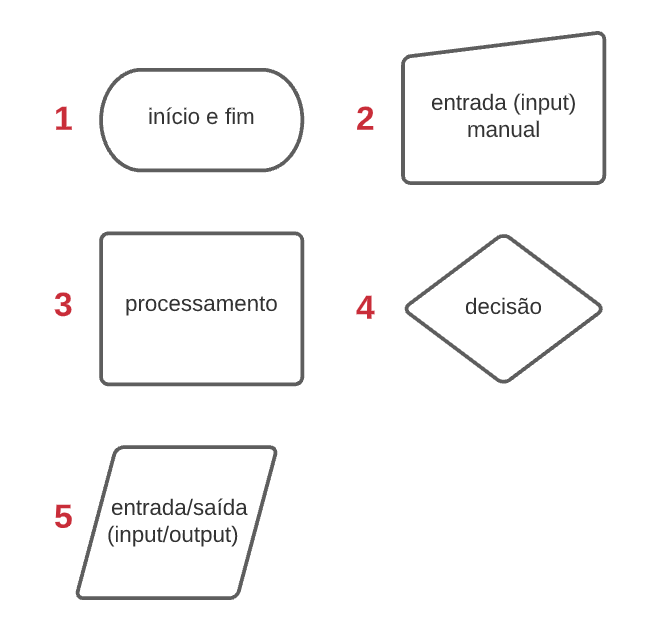
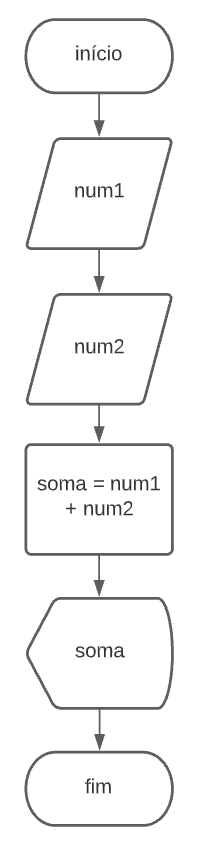
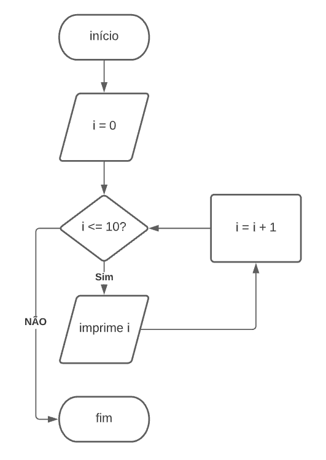

# JavaScript 1 - Algoritmos de ordenação

## Aula - 01: Pensando em algoritmos

### - Nosso primeiro problema

Olá, boas-vindas ao curso de algoritmos com JavaScript.

Nesse curso, nós vamos conversar sobre o que são algoritmos e por que o estudo de algoritmos é tão importante em programação. Vamos começar analisando alguns problemas comuns de programação e de que forma podemos resolvê-los com algoritmos, algoritmos diversos.

Esse curso está voltado para quem está começando do começo em programação e escolheu o JavaScript como linguagem, mas que já teve contato com os fundamentos do JavaScript: o que são dados primitivos, número, string, booleano, arrays, objetos e funções.

Onde nós começamos e até onde vamos? Vamos começar traduzindo problemas, às vezes problemas do dia a dia mesmo, que resolvemos de cabeça, como falamos.

E vamos traduzir a resolução desses problemas para o passo a passo de um algoritmo. Vamos escrever esses algoritmos usando funções e métodos do JavaScript. Vamos transcrever esses passos, esses fluxos para código.

Juntar algoritmos. Às vezes, nós precisamos, para resolver problemas, trabalhar com mais de um algoritmo de uma vez. Vamos ver como usamos isso, como isso funciona no código.

E testes de mesa. Às vezes, nós sabemos que um bloco de código está funcionando, mas não entendemos totalmente de que forma isso está ocorrendo. Por exemplo, quando usamos um algoritmo pronto – vamos ver como isso funciona durante o curso – temos lá um código que resolver um problema, mas o que está acontecendo dentro desse código?

O que está guardado nas variáveis, o que faz cada linha? Então, os testes de mesa nos ajudam a seguir o fluxo de um algoritmo, o fluxo de um bloco de código linha por linha, variável por variável, e nós conseguimos entender exatamente todos os passos. Então, vamos fazer alguns testes de mesa.

Vamos comparar algoritmos também. Como sabemos se um algoritmo funciona bem para o nosso caso e o que é funcionar bem, quando falamos de algoritmos.

Análise de complexidade porque, pensando que algoritmos executam instruções, instruções de código, como conseguimos saber quão complexo um algoritmo pode se tornar baseado na quantidade de dados que temos para trabalhar com ele?

Então, tenho muitos dados, tenho uma lista com muitos livros, tenho vários candidatos de um vestibular, como eu uso algoritmos de busca para isso? Como uso um algoritmo de ordenação?

E o quão complexo que o código desse algoritmo, que as instruções podem se tornar em termos de processamento, de acordo com a quantidade de dados que trabalhamos? Vamos ver como isso funciona também.

Nesse curso, vamos trabalhar firme com algumas partes fundamentais do JavaScript. Tipos de dados, variáveis, funções, arrays e objetos. Mas não vamos parar para explicar em detalhes o funcionamento, o conceito por trás de cada uma dessas partes fundamentais.

Você vai aproveitar melhor o curso se já tiver feito os cursos anteriores sobre fundamentos do JavaScript ou se você já tiver estudado sobre esses assuntos.

Lembrando que, nesse curso, nós não vamos falar sobre assuntos específicos de front-end, mas tudo que vamos ver aqui você pode abstrair e aproveitar os conceitos da mesma forma.

Depois desse curso, você pode estudar mais algoritmos por conta própria, entender como diversos algoritmos funcionam para diversos problemas.

Quais as complexidades de cada um e como você consegue, por exemplo, pegar o conceito de um algoritmo escrito em pseudocódigo e passá-lo para JavaScript para você conseguir usar em um projeto ou testar e entender melhor como ele funciona.


### - Do papel para o código

Agora que já temos o nosso "algoritmo mental" do fluxo que fizemos em JavaScript, vamos escrever esse código. Então, como fazemos para passar aquele fluxo que pensamos que criamos direto na página da nossa livraria? Vamos passar isso para o JavaScript, então.

Primeira coisa que vamos precisar é criar um array, então vou criar const precosLivros. Por enquanto, criamos somente um array com o preço de cada livro, para começarmos em pequenos passos.

```javascript
const precoLivros = [25,15,30,50,45,20];
```

Os preços são [25, 15, 30, 50, 45, 20]. Então, um array em JavaScript. Nós precisamos guardar em algum lugar aquilo que eu estava chamando de variáveis mentais – agora não vai ser, agora vamos fazer no JavaScript.

Uma que guarde o valor atual que estamos vendo, qual o produto atual que estamos analisando, vou chamar de let atual. Vou iniciá-la com 0, vai ser o primeiro índice do array que estamos trabalhando.

E um outro let que vou chamar de maisBarato, que também vou iniciar com 0. É aquele onde vamos guardar - que estávamos guardando na cabeça - qual é o produto, qual é o índice do array que tem o menor valor. No caso do nosso array, teria que guardar o 15 mais do que qualquer outro.

O que temos que fazer agora? Temos que percorrer toda essa lista de livros, confirmar qual é o mais barato de todos, porque sabemos na cabeça, mas agora o JavaScript tem que nos dizer.

Podemos usar uma das várias formas que o JavaScript tem para trabalhar com loops, com laços de repetição, o que temos que fazer é percorrer listas, percorrer um array, que é um for. Então, vou criar um for que vai começar com let.

Vou chamar a variável inicial desse for de atual, então for (let atual = 0;). Já que estamos iniciando, dentro do nosso for, uma let atual, nós não precisamos iniciá-la do lado de fora, nós podemos trabalhar só com a variável atual que está dentro do for, já vai fazer o mesmo trabalho.

Vamos percorrer esse array enquanto atual for menor do que o tamanho do nosso array de livros, então (let atual = 0; atual < precosLivros.length;), com “gth” no final – sem errar, porque eu sempre erro e troco as últimas letras.

Vamos atualizar a nossa variável atual, vamos incrementá-la de um em um, atual++, para ir pulando de índice em índice do array. E aqui dentro vamos criar o nosso //código.

Se lembrarmos a forma como nós criamos esse algoritmo na nossa cabeça – vou voltar na nossa página –, o que tem que ser feito dentro desse for nós já falamos. Se o produto atual for menor, ele se torna o mais barato.

Então, se o que nós estivermos vendo no momento na lista, por exemplo, “1” e “PHP”, ele é o que nós estamos vendo na lista? Ele é o de preço menor do que tínhamos antes? É. Então, ele se torna o menor, ele se torna o mais barato. E por aí vai.

Nós meio que falamos, na cabeça, o que temos que transformar em código. Então, voltando para o nosso for, o que temos que fazer é uma condição, if.

Se o produto atual, for o mais barato da lista, nós o guardamos dentro da nossa variável “preço menor”. No caso, eu chamei de maisBarato, então ele vai ser o mais barato e nós vamos guardar o número de índice dele dentro da nossa variável let maisBarato.

A nossa condição é if (precosLivros), que é o nome do nosso array, na posição [atual], for menor do que nós tínhamos anteriormente – o que tínhamos anteriormente?

Nós começamos com “0” para comparar, então o primeiro livro que nós comparamos, ainda não tem muito o que ser comparado. Se só temos um livro de 25, ele é o atual e é também o mais barato, então estamos começando tudo com 0.

Então, vamos dizer que precosLivros na posição maisBarato. Lembrando que as variáveis guardam valores inteiros que traduzimos como índices do array. Então, precosLivros na variável atual é precosLivros na posição 0, ou seja, na posição 25.

Vou até marcar com o comentário aqui, a posição 0. E precosLivros na posição maisBarato, o maisBarato também é uma variável que está guardando 0, e 0 é 25, então é onde estamos começando.

Se a atual for menor do que já está guardado como maisBarato, vamos fazer alguma coisa, ou seja, temos que fazer com que o livro na posição atual se torne o mais barato – esquece o que tinha antes.

Então, nós começamos na posição 0, mas, se a posição 1 for mais maisBarato, esquece o 0 que estava guardado dentro da variável e vamos colocar o 1 aqui.

Então, o que tem que acontecer? maisBarato = atual. Nós declaramos uma let na nossa linha 4, ou seja, podemos substituir o valor dela de 0 para 1, de 1 para 2, de 2 para 3, de acordo com o índice onde está o menor valor do array.

No caso, o 15, que já sabemos, olhando, que é o índice 1, mas o JavaScript ainda não sabe, ele vai ter que processar isso para nós.

A última coisa a fazer, depois que sai desse for, é um console.log e olivro mais barato custa e podemos colocar, com template strings aqui, abrir cifrão e chaves, colocar ${precosLivros}, que é o nome do nosso array, em qual posição? Na posição maisBarato.

Porque, lembrando, a partir do momento que o JavaScript entra no for, ele vai percorrer o for inteiro antes de continuar. Então, o console.log que nós colocamos por último, na linha 12, só vai ser executado depois que passar por todo o array.

Então, nesse momento, nossa variável maisBarato teoricamente já está atualizada, passou pelo array inteiro, e já está guardando o que é realmente o menor valor da lista.

Então, é precosLivros na posição que não sabemos – sabemos que é 1, mas o JavaScript ainda não. maisBarato que vai ter aqui um número entre 0 e 5 guardado dentro dessa variável.

Vou salvar, venho no terminal e mando executar com node index.js, que é o nome que eu criei para esse arquivo. Então, o livro mais barato custa 15, ou seja, nós já sabíamos e o JavaScript agora também já sabe.

Porque nós fizemos com que o JavaScript percorresse, com o código, exatamente o mesmo caminho que nós fizemos mentalmente usando o nosso site, usando as nossas variáveis.

Nós fizemos o que chamamos de “teste de mesa”, vou deixar um material extra para vocês sobre o que é um teste de mesa, mas, basicamente, nós fizemos uma interpretação do código na nossa cabeça e fomos marcando em cada momento do loop, em cada momento do processamento, o que tinha guardado em determinadas variáveis.

Aqui eu chamei a variável de “menor”, no código eu acabei chamando de maisBarato, mas é a mesma variável. E a variável “atual”, que é a que está fazendo o controle desse array, de passar índice por índice.

Então, o que nós fizemos foi criar o nosso primeiro algoritmo para resolver o nosso primeiro problema que é encontrar o livro mais barato em uma lista desordenada.

Fizemos isso a partir da nossa cabeça e sem perceber, é uma coisa que fazemos todos os dias. Com o código, podemos passar os mesmos passos que fazemos na cabeça para o código, só fazendo de uma forma que o JavaScript entende.

Mas, como falei antes, existe mais de uma forma de resolver um problema. Sempre ou quase sempre existe. Vamos dar uma olhada, continuaremos a estudar os nossos algoritmos.


### - Exibindo os livros

[00:00] Antes de continuarmos, vamos refatorar esse array de livros que nós criamos para termos informações mais completas para trabalharmos. Porque trabalhar com Array de preços vai cumprir a missão, mas fica um pouco mais trabalhoso, porque vamos receber os valores sem saber de que livros estamos falando, e se tiver dois livros com o mesmo preço, como faz?

[00:22] Então, vamos fazer o seguinte, vou extrair esse array que chamei de precosLivros, vou criar outro arquivo, vou chamá-lo de “listaLivros.js”, na mesma pasta, e vou extrair essa array para esse arquivo.

[00:41] Então, vou continuar o chamando de precosLivros, tirá-lo do nosso “index.js” e passá-lo para a “listaLivros.js”, então “Ctrl + X” no nosso array, e “Ctrl + V” no nosso listaLivros.

[01:06] Então, “listaLivros.js” eu vou deixar com a variável precosLivros mesmo, e aqui, onde temos um array só de números, nós podemos ter um array de objetos, que cada objeto terá seu nome.

[01:25] Então, tenho a propriedade titulo: “JavaScript” para o primeiro livro, e a propriedade preco: 25 que, para JavaScript, é 25. A mesma coisa nós fazemos para todos os outros.

[01:45] O segundo elemento é PHP e a propriedade é 15: titulo: “PHP”, preco: 15.

[02:00] O terceiro eu já não lembro, nós olhamos, que é o de Java, 30,00. Então, titulo: “Java”, preco: 30. E, quase finalizando, o de Elixir é titulo: “Elixir”, preco: 50.

[02:40] Tem também o de Go e o de Python. titulo: “Go” e preco: 45; finalmente o último, mas não menos importante, que é titulo: “Python” e preco: 20.

[03:15] Agora temos um array de objetos e conseguimos identificar o que é o que, qual é o livro que custa 25, qual é o livro que custo 30 etc. Vamos dar uma última refatorada nesse código.

[03:30] O nosso arquivo “index.js”, agora preciso trazer o nosso array para cá. Vou exportar a nossa const precosLivros. Na última linha do arquivo "listaLivros.js", vou chamar module.exports = precosLivros.

[03:53] Podemos agora voltar para “index.js” e importar, na primeira linha do arquivo, antes de qualquer coisa, o const livros = require(‘./listaLivros’). Então, agora podemos chamar a const Livros que ela vai trazer o array para nós.

[04:25] E podemos refatorar essas partes do código do nosso for onde nós trabalhamos com os valores dos livros. Então, temos a nossa let atual, fica igual. Agora, precosLivros.length não é mais precosLivros porque estamos importando esse array de outro lugar, de livros.

[04:46] Então, precosLivros, em todos os lugares onde nós declaramos, agora é apenas livros. Lembrando que, agora, não adianta só trazermos livros[maisBarato], porque estamos trabalhando com objetos. Então, o que queremos comparar?

[05:05] Temos duas propriedades: a propriedade do titulo, que é do tipo string, e a propriedade preco, que é do tipo número. Então, temos que dizer no nosso for agora que o que nós vamos comparar é livros na posição [atual].preco e livros na posição [maisBarato].preco também.

[05:27] Senão o JavaScript não vai saber qual propriedade do objeto queremos usar para fazer essa comparação. No console.log(‘ o livro mais barato custa ${precosLivros} na posição [maisBarato].preco e podemos até adicionar um nome, e o título é, coloca outro place holder com cifrão e chaves, ${}.

[05:55] ${livros[maisBarato].titulo}, e aproveito e corrijo o meu console.log que não é mais (precosLivros[maisBarato].preco), agora é só (livros[maisBarato].preco) e (livros[maisBarato].titulo).

[06:18] Então, testamos novamente para ver se está tudo funcionando, limpar o terminal. E retornou: “o livro mais barato custa 15 e o título é PHP”. Tudo funcionando direito.

[06:33] O que nós fizemos aqui, na verdade, nós só demos uma melhorada no código para termos informações mais recheadas do que estamos trabalhando, e também começamos a extrair um pouco as partes do código para não ficar tudo nesse “index.js”.

[06:48] Vamos fazendo outros melhoramentos durante o curso, tem mais coisas para mexer, vamos extrair um pouco mais de código, separar um pouco mais de código, mas vamos fazendo isso aos poucos, vamos continuar vendo os algoritmos.


### - Para saber mais: Representando algoritmos

Você já viu ou já ouviu falar de fluxogramas?

Um fluxograma é uma forma de representarmos os passos de um algoritmo, através de símbolos bem definidos para cada tipo de processo (entrada de dados, processamento, condicionais, etc) para facilitar a visualização e o mapeamento de todos os passos necessários e/ou possíveis em um determinado processo. São muito utilizados para descrever algoritmos, mas podem ser utilizados em qualquer situação que envolva um fluxo finito de ações, com entrada e saída.

Há outras formas de se representar um algoritmo além do fluxograma, como a descrição textual/verbal dos passos (que estamos utilizando nesse curso), o pseudo-código ou mesmo a própria leitura do código em JavaScript ou outra linguagem de programação. Você pode conferir exemplos destas três formas [neste artigo da Alura.](https://www.alura.com.br/artigos/algoritmos-e-logica-de-programacao?_gl=1*1lnj3oa*_ga*MTIyMzM4MDk5NC4xNjkyNzQ1NDk5*_ga_1EPWSW3PCS*MTY5NTY3ODQ0NC4xMy4xLjE2OTU2Nzk2MjguMC4wLjA.*_fplc*ZXRoUWd4VzVvaDRVSkQ3SmR3VyUyQjNmaEFFak9Ec0hDJTJGSGZ0OVNGVFZyZFU1b1YxZnhXbUZQZ2hCVjVCalE1ZEpIaElzcG1kbE16Rnp5YkhBRXclMkJrOFozMzIwUGM3bUhzZ3NGYTl6JTJCdmQxbzdmdUFYdnAlMkJJdyUyRkszWUFTak9RJTNEJTNE)

No caso do fluxograma, os diferentes formatos das caixas de texto ajudam a definir os passos lógicos de um processo. Veja alguns exemplos:



As figuras padrão para os tipos de operação em um fluxograma são:

#### 1. Início/fim: Marcam o início ou término do processamento que está sendo descrito, normalmente “início” ou “fim”, mas também podem ser utilizados as saídas de processamentos anteriores ou entradas de processamentos posteriores, como “envio do formulário”. Representado por uma figura oval ou retângulo com bordas arredondadas;
#### 2. Entrada manual: input (ou entrada) manual de dados, por exemplo dados informados pelo usuário do sistema. Representado por um retângulo com o lado direito mais alto;
#### 3. Processamento: bloco ou conjunto de operações que serão efetuadas com os dados recebidos. Representado por um retângulo;
#### 4. Decisão: quando o programa pode seguir em mais de um caminho, que envolve uma decisão cujo resultado é “sim” ou “não” (os equivalentes a true e false). Representado por um losango;
#### 5. Entrada/saída: Processo de recebimento dos dados pelo programa (input ) ou retorno do resultado de um processamento (output). Representado por um paralelogramo.

Vamos ilustrar melhor com um exemplo de fluxograma para uma soma entre dois números:




O fluxograma acima descreve:

#### 1. o ponto de início do processamento;
#### 2. a entrada de dois dados (as variáveis num1 e num2), cada um por vez;
#### 3. o processamento (operação matemática entre os dois números);
#### 4. a saída do resultado através da variável soma;
#### 5. o fim do processamento.

Podemos representar o algoritmo acima com código JavaScript:

```JavaScript
const num1 = 2;
const num2 = 2;

const soma = num1 + num2;

console.log(soma) //4
```

Vamos ver mais um exemplo, para um loop que exibe no console números de 0 a 10:



O fluxograma acima pode ser traduzido, em código JavaScript, em um for:

```JavaScript
for (let i = 0; i <= 10; i++) {
 console.log(i);
}
```

Existem outros símbolos que usamos nos fluxogramas para ilustrar outros tipos de operações possíveis, como impressão em papel ou envio de dados para um banco.

Você pode praticar com fluxogramas para criar algoritmos tanto para códigos que você já escreveu quanto para “colocar no papel” e ajudar a organizar a estrutura para um algoritmo que esteja desenvolvendo; ou mesmo treinar com outras situações, como fazer um bolo ou pagar uma conta de luz.


### - Sobre algoritmos

A respeito do que já conversamos sobre algoritmos, podemos concluir que:
#### -> Algoritmos podem ser quebrados em partes menores e estas partes utilizadas em conjunto na resolução de um problema. Dependendo do problema que queremos resolver, um algoritmo pode se tornar muito longo, com muitas sequências de passos, e mais difícil de se construir e testar. Assim como em código, é costume quebrar o algoritmo de resolução de uma tarefa complexa em vários algoritmos (ou partes) menores, especializadas e intercambiáveis para cada parte do problema.

#### -> Algoritmos são sequências finitas de ações para a resolução de um problema. Estas ações podem ser traduzidas em passos lógicos de um código, instruções para uma receita culinária ou montagem de um móvel, ou até mesmo para ilustrar sequências de ações executáveis que fazemos no nosso dia-a-dia.

#### -> A mesma sequência finita de ações de um algoritmo pode ser utilizada para resolver o mesmo problema em diversas linguagens de programação. Vimos que a resolução de um problema utilizando algoritmos pode muito bem começar fora do código e depois ser “traduzida” para a linguagem de programação de nossa preferência, mas o conceito por trás da solução é o mesmo.


### - Faça como eu fiz: Encontrar o livro mais caro

Durante a aula, criamos um algoritmo para encontrar o menor valor em uma lista (array). Mas a mesma lógica pode ser invertida para funcionar com o maior valor.

Dentro do for, basta invertermos a condição do if, para ao invés de verificar se o produto atual tem valor menor <, agora verifique se tem valor maior >:

```JavaScript
let maisCaro = 0;
for (let atual = 0; atual < livros.length; atual++) {
 if (livros[atual].preco > livros[maisCaro].preco) {
   maisCaro = atual;
 }
}
```

Futuramente este loop poderá ser extraído para uma função que faz ambas as operações e consegue, com o mesmo código, encontrar tanto o valor menor quanto o maior.


### - O que aprendemos?

Nessa aula, você aprendeu
* Que algoritmos são sequências finitas de passos lógicos para a resolução de um problema e que podem representar tanto problemas comuns em programação quanto qualquer situação que envolva passos lógicos;
* Que pensar de forma algorítmica não se resume a código e nem precisa necessariamente começar pelo código em si;
* Como traduzir os passos de um algoritmo para a linguagem de programação que escolhemos trabalhar (no caso, JavaScript), através de estruturas fundamentais da linguagem como variáveis, laços de repetição e condicionais.


## Aula - 02: Ordenação com Selection Sort

### - Ordenar para organizar

[00:00] Já sabemos, então, como obtemos o nome e o preço do livro mais barato de uma lista de livros. Nós criamos um algoritmo, um processo, passos finitos para resolver um problema, que percorre uma lista de livros e encontra o mais barato.

[00:20] Acontece, normalmente, quando estamos nessa situação de eu tenho um vale-presente e quero comprar alguns livros, eu tenho um valor X para gastar em livros/mercado, nós recebemos uma lista de livros e queremos saber quais são os mais baratos.

[00:38] Tenho um vale-presente de cem reais, vamos ver quantos livros eu consigo comprar com cem reais, não necessariamente um com o preço cheio, pode ser vários, dez livros de 10 reais etc.

[00:50] Então, muitas vezes, nós não queremos só a opção mais barata, como fizemos anteriormente, para achar só PHP de 15,00. Nós queremos ter opções. Por exemplo, dois ou três livros mais baratos.

[01:02] Então, novamente, o que conseguimos fazer? Podemos criar variáveis mentais, como criamos na nossa cabeça, para separar uns dois ou três livros mais baratos.

[01:11] Mas, se a lista for muito grande, acabamos tendo que pegar papel e caneta e ir escrevendo. Se fossemos colocar essas variáveis mentais por extenso para ver, seria algo mais ou menos assim.

[01:24] Temos o livro “atual” que estamos vendo, temos o “maisBarato”, e depois teríamos que começar a criar um monte de outras variáveis. Uma variável para o segundo mais barato, outra variável para o terceiro mais barato.

[01:43] Se eu quisesse os cinco mais baratos de uma lista de cinquenta, teria que criar os cinco mais baratos, os seis mais baratos etc. Imagina se fossemos colocar isso no JavaScript, não ficaria muito prático.

[01:57] Aqui, ao invés de let maisBarato, teria que ter let maisBarato, segundo maisBarato, terceiro maisBarato, e, obviamente, acaba ficando impraticável.

[02:07] Acho que já deu para ter uma ideia que esse é um problema muito comum em programação, é um problema de ordenação, afinal de contas, é muito comum esse situação em que nós queremos ir em um e-commerce e achar os mais baratos, queremos achar as mensagens mais recentes, queremos achar os vídeos que têm mais likes, etc.

[02:30] No caso da nossa lista de livros, os valores estão misturados, aí dificulta um pouco, mas, se modificarmos a nossa lista, como já fizemos anteriormente de ir visitando índice por índice, por exemplo, o primeiro índice é JavaScript e em seguida tenho o mais barato que é de 15,00, troco eles de lugar.

[02:49] Agora tenho 15,00, 25,00, 30,00, 50,00, 45,00 – 45,00 é menor que 50,00, vamos botá-lo de volta – e agora tenho 45,00, 50,00 e 20,00, então sei que tenho que empurrar o 20,00 como segundo elemento, para a posição de número 1 no nosso array.

[03:08] Então, se modificamos um pouco a lista e a ordenamos, fica muito mais fácil de pegarmos, por exemplo, os três livros mais baratos. Agora eu sei que os três livros mais baratos são o de PHP 15,00, Python 20,00 e JavaScript 25,00.

[03:23] Se for uma lista de cinquenta livros e eu quero os cinco primeiros livros mais baratos, também já está ordenado, é só pegar os cinco primeiros elementos da lista.

[03:32] Então, agora sabemos qual é o mais caro, qual é o livro mais caro que tem nessa livraria? Também está fácil porque ele está lá no final de uma lista ordenada do menor para o maior, ou também poderíamos inverter isso, seria a primeira posição de uma lista ordenada de maior para menor.

[03:50] Fica muito mais fácil agora buscarmos elementos. Vale para produtos mais baratos ou mais caros etc. Porém, uma coisa importante, nós formos fazendo aqui, arrastando os nossos livros, meio que com a ajuda da cabeça, mas a forma como vamos ordenar esses elementos quando trabalhamos com código é super importante.

[04:12] Porque, normalmente, nós trabalhamos com volumes de dados grandes. A nossa livraria é pequena, tem só seis livros de programação, mas se fosse uma livraria especializada, ela teria centenas, milhares de títulos relacionados a programação.

[04:27] E o que vamos ver a partir de agora é algumas formas de fazer isso, ou seja, alguns algoritmos de ordenação. Vamos ver como trabalhar com eles a partir do próximo vídeo.


### - Reaproveitando código

[00:00] Já vimos que, às vezes, vale a pena ordenarmos uma lista para conseguir pegar os dois primeiros, o primeiro, os três primeiros etc. Então, o que vamos fazer agora é construir no código mais ou menos os mesmos passos que fizemos anteriormente usando as nossas "variáveis mentais", digamos assim.

[00:22] Novamente, o que temos que fazer é traduzir para o JavaScript, para uma linguagem que o computador consegue compreender. No código, a primeira coisa que eu vou fazer é criar um novo arquivo. Vou chamar esse novo arquivo de “selectionSort.js”.

[00:41] Sort é ordenar, em inglês, é um algoritmo de sorting, um algoritmo de ordenação. Já vamos ver por que ele tem esse nome legal. Criei meu arquivo “selectionSort.js” e vou importar const livros = require('./listaLivros') e importei o nosso array de livros.

[01:09] Já que estamos trabalhando com a ajuda do nosso site da livraria, vamos lembrar que nós, mentalmente, criamos, para fazer a ordenação, um loop, um laço de repetição que percorreu toda a lista e foi ordenando, trocando de lugar os livros mais caros com os livros mais baratos.

[01:31] Então, o que temos que fazer no nosso arquivo “selectionSort.js” é também criar um for. Vamos continuar trabalhando com esse for mais clássico que tem no JavaScript e tem também em várias linguagens de programação. Se você quiser depois pensar em outra linguagem, fica mais fácil de fazer essa transferência.

[01:47] De novo, vamos trabalhar com for (let atual = 0), começar do começo da nossa lista. Nosso for vai funcionar enquanto atual < livros.length, o tamanho da nossa lista de livros. E vamos incrementar atual++ para percorrer a lista toda.

[02:18] O que nós fizemos, mentalmente? Nós comparamos valores de livros e vimos qual tinha o menos preço. Nós já temos um código pronto, que foi o que nós fizemos anteriormente e está em “index.js”, para saber qual é o menor preço.

[02:37] Então, nós podemos pegar o que foi feito anteriormente em “index.js” e extrair isso para uma função para reaproveitarmos, ao invés de simplesmente copiar o for que fizemos antes e colar no “selectionSort.js”, não é muito prático.

[02:52] Vou trocar o nome desse arquivo “index.js” para “menorValor.js”, fica mais fácil de identificarmos. Dentro de “menorValor.js”, vamos criar a nossa função. Vou criar uma function, vou chama-la de menorValor.

[03:12] Essa função tem que receber um array, vou chamar esse parâmetro de arrProdutos, deixar mais genérico qual tipo de produto vai receber, pode receber livros, colchões, chocolates etc.

[03:27] Essa função tem que rodar a partir de uma posição inicial do array para percorrer, então vou dizer que essa função também vai receber uma posição inicial, posicaoInicial, para fazer a comparação, porque lembra que o nosso for vai andar do primeiro índice do array em direção ao fim.

[03:52] A posição onde vai ser feita a verificação sempre vai estar modificando, então nós passamos isso através de parâmetro para dentro da função. O código que nós criamos anteriormente, o let maisBarato e o for, nós passamos para dentro da função.

[04:06] E agora, ao invés de um console.log, a nossa função menorValor vai retornar o valor da variável return maisBarato;, que vai ser um número de 0 a X, que vai ser o número referente à posição no array onde vamos encontrar o item mais barato, começando a partir de certo ponto.

[04:29] Como assim, começando a partir de certo ponto? Porque nós começamos a nossa verificação a partir do índice 0, mas depois que o índice 0 já está ordenado, nós não precisamos mais nos preocupar com ele, podemos começar a nossa verificação na próxima vez a partir do índice 1, depois a partir do índice 2, etc.

[04:47] Por isso, nós vamos passar o nosso índice inicial por parâmetro e, para cada loop, a nossa função vai retornar qual é o índice referente ao produto mais barato.

[05:06] Vou deletar o console.log que fizemos anteriormente, não precisamos mais dele, e vou exportar, antes que eu esqueça, para o module.exports = menorValor. Agora podemos usar essa função em outras partes do código.

[05:22] Voltando ao arquivo “selectionSort.js”, no topo do arquivo, junto com a nossa const livros, eu vou criar uma const menorValor = require(‘./menorValor’).

[05:42] Agora já podemos usar a função nesse arquivo também. Então, temos um for, por enquanto ele não está fazendo nada dentro, que começa em uma posição atual que nós colocamos como = 0.

[05:57] Vamos voltar só no menorValor porque eu esqueci de uma coisa muito importante. Eu criei a função, passei parâmetros para ela, mas, dentro do for, eu não fiz nenhuma modificação para incluir esses parâmetros em nenhum lugar, então já estava esquecendo disso.

[06:15] Dentro do nosso for não é mais livros porque vamos estar trabalhando com um array genérico, então arrProdutos.length, e a mesma coisa dentro do if, arrProdutos na posição [atual] for menor do que arrProdutos[maisBarato]preco.

[06:46] E agora maisBarato = atual, só que uma coisa muito importante, nós também temos que passar uma posicaoInicial. A posicaoInicial agora vai ser igual a maisBarato.

[07:01] Por que maisBarato vai ser igual à posicaoInicial? Porque, quando nós começamos – vamos voltar para o nosso site – a verificar, nós só temos o primeiro produto, e o primeiro produto nós não sabemos se é mais barato ou mais caro, ele é onde estamos começando.

[07:19] Então, se eu tenho só JavaScript como o primeiro elemento do array, eu não tenho com o que compará-lo, eu só vou ter como compará-lo a partir do momento que eu começo a percorrer.

[07:31] E a mesma coisa quando nós passamos a trabalhar com o segundo elemento. O segundo elemento é o PHP, o primeiro nós já sabemos que está ordenado – vou trocar aqui. Então, a mesma coisa, o primeiro que tem no array, seja qualquer produto, nós não sabemos se ele é o mais barato ou o mais caro até o momento em que começamos a fazer as comparações.

[07:58] Então, nós fazemos essa modificação, o maisBarato deixa de ser 0, o maisBarato vai ser a posicaoInicial onde nós começamos a fazer a comparação. Nós começamos no 0, a partir do momento em que já arrumamos o 0, não precisa mais se podemos passar para o próximo.

[08:16] Agora, a posição inicial é o 1, então vai percorrer o array a partir do 1. Depois que trocamos e verificamos que não tem, na posição, nenhum mais barato, nós passamos para o 2, então a posição inicial agora é o índice 2, e vamos do índice 2 para frente, e por aí vai.

[08:35] Por isso que, agora que nós extraímos o nosso código de menorValor para uma função, nós temos que passar a posição onde ele começa a trabalhar e a posicaoInicial é onde nós começamos, então o maisBarato sempre começa da posicaoInicial, seja 0, seja 1 ou seja 2.

[08:54] E dentro do for, a mesma coisa. O nosso let atual, ao invés de iniciar a variável com o valor de 0, começa também a partir de posicaoInicial, porque, lembrando como fizemos lá atrás, nós começamos os dois com 0.

[09:14] Só que agora vamos andar com esse código do 0 para o 1, para o 2, para o 3. Não faz sentido a nossa let atual começar sempre do 0, ela vai começar da posição atual que nós indicarmos.

[09:27] Agora podemos voltar para o nosso selectionSort e agora estamos fazendo o loop que o “selectionSort.js” vai fazer, que o nosso algoritmo de ordenação vai fazer.

[09:44] Estamos fazendo partes pequenas. Lembra que eu falei do ovo que nós fazíamos um pequeno desvio no algoritmo para fazer uma sequência de passos para quebrar o ovo em um pote para voltar para o bolo? A mesma coisa que estamos fazendo aqui.

[09:59] Nós extraímos em menorValor e agora vamos usá-lo dentro de outro algoritmo para conseguir ir vendo o menor e ordenando.


### - Selection Sort

[00:00] Primeira coisa que temos que fazer é verificar, a partir do 0, que é onde estamos começando. Vou desordenar novamente a nossa lista de livros. Estamos começando no 0 e o for do nosso algoritmo de ordenação também está começando do 0.

[00:23] Primeira coisa a fazer é verificar qual é o menor valor do nosso array começando com 0. Nós já criamos o código para isso, eu vou executar a função menorValor, criar uma let menor para salvar o retorno dessa função.

[00:44] Então, let menor, dentro do for mesmo nós vamos criar essa let menor = menorValor, chamamos a função, passamos para ela, como primeiro parâmetro, o array que ela está esperando receber, o arrProdutos e aqui é livros, na hora que executarmos, vamos passar livros.

[01:04] Qual é a posição inicial que queremos começar? Estamos começando o nosso for nesse momento, então vamos começar com atual. atual, nesse momento, é 0.

[01:20] Então, quando a função menorValor for executada nesse momento que a função vai rodar, nós vamos ter a nossa variável livros e o valor de atual vai ser 0. Então, essa função vai ser executada e vai retornar para nós um inteiro de 0 a 5, e esse inteiro vai ser guardado nessa variável.

[01:53] A variável menor, o tipo de dado que ela vai guardar é um inteiro com o número do índice de 0 a 5 onde vai estar o produto mais barato, em um intervalo que vai, nesse momento, de 0 a 5, porque estamos começando o nosso loop nesse momento.

[02:15] Executamos, isso vai ser salvo. Há dois próximos passos que é criar mais duas variáveis. Então, vou criar uma variável que vou chamar de let livroAtual. Não estou mais guardando o índice, estou guardando a própria informação, que é livros na posição [atual].

[02:41] Porque lembra que o que nós queremos fazer é trocar as informações de lugar, então tenho que pegar realmente o dado, o objeto que tem lá – chave, valor, nome e preço do livro – e trocar essas informações de lugar.

[02:59] Já que eu tenho que trocar as informações de lugar, eu preciso guardá-las em uma variável para poder fazer essa troca. Então, a minha variável livroAtual está guardando uma informação, que é livros na posição [atual], livros na posição 0, que, no caso, vai ser um objeto que é o que está na posição 0 do meu array.

[03:23] E eu vou criar mais uma variável que vou chamar de let livroMenorPreco. Aqui vou guardar a informação de qual é o livro que está na posição livros[menor].

[03:40] Por que posição menor? Porque o retorno da função menorValor vai me voltar um número, uma posição. Ela vai procurar dentro do array de livros, vai achar qual é a posição de 0 a 5 que tem o livro mais barato.

[04:01] E o que eu estou pedindo para o JavaScript fazer é acessar o array de livros no índice que está guardado, 0, 1, ou 2 – no caso, sabemos que é o 1 porque estamos vendo o array e o JavaScript não vê, ele não sabe.

[04:20] Então, sabemos que aqui é o 15,00. O que estou pedindo para ser guardado na variável livroMenorPreco é o dado que está guardado no array de livros, na posição 1, que é PHP, é um objeto que tem chave e valor, titulo: PHP e preco: 15.

[04:37] Então, o que nós fizemos nessas duas variáveis não é guardar uma posição, é guardar uma informação, um dado, porque vamos precisar trocar esses dados de lugar no array.

[04:48] A partir do momento que fazemos isso, nós trocamos, fazemos livros[atual] = livroMenorPreco, então estou acessando a posição atual e trocando a informação que tem dentro dela, trocando o dado que tem dentro dela, o objeto.

[05:10] E a mesma coisa para livros[menor] = livroAtual. Então, estou acessando posições no array e trocando as informações que tem dentro dela, trocando os objetos, objeto com chave e valor JavaScript de lugar com o objeto de chave e valor PHP.

[05:40] Vou trocar de lugar o PHP com JavaScript, e agora, sim, depois de trocado de lugar, nós conseguimos até exibir, no nosso console, o resultado. Então, trocou de lugar, passou por todos os itens do array, nós exibimos console.log, posso exibir o array inteiro, console.log(livros).

[06:12] Mas, lembrando que o for vai fazer isso, todo esse processo, passar a atual de 0 para 1, a atual passa a ser 1. Então, como o atual passa a ser 1 e o valor dessa variável de início começa do 0 e depois vai trocando.

[06:36] Como a atual passa a ser 1, o menor valor – lembrando que a função vai ser executada novamente, porque ela está dentro do for, só que agora passando com o parâmetro 1 ao invés de 0.

[06:54] Na prática, o que acontece? O 0 já está ordenado, nós não precisamos mais dele, então a atual passa a ser 1. A posição inicial, onde vai começar a ver o menor valor agora é 1, então do 1 para frente. Ele checa com o 1, com o 2, com o 3, com o 4 e com o 5.

[07:14] Vamos repetir o mesmo processo aqui, de ver qual é o livroAtual, livros na posição 1, e ver qual é o livroMenorPreco, que é o resultado da nossa função. Ele vai retornar um número, nós estamos guardando as informações, estamos trocando as informações de lugar.

[07:35] O que nós podemos fazer aqui, para ficar mais legal, é colocarmos mais um console.log no meio para ele dizer para nós qual é o livro atual e qual é o livro menor preço, livros[menor], que é o retorno da função.

[08:08] Vamos fazer o seguinte, estou fazendo um monte de código aqui e não rodei nada ainda. Vamos rodar isso para ver se está tudo certo, vai que tem algum erro e não vimos até agora.

[08:20] Vamos lá, node selectionSort.js, vamos ver se está tudo certo, ele tem que exibir alguns console.log para nós. Vamos voltar aqui, ele já exibiu no final a nossa array ordenada, 15, 20, 25, 30, 45 e 50.

[08:41] E ele exibiu também os passos do nosso algoritmo. Ele começa com livro atual { titulo: JavaScript, preco: 25} e o menor preço {titulo: PHP, preco 15}, porque estamos trabalhando com o começo do array, que é o índice 0.

[09:02] Vou pedir mais um console.log para vermos também, que é o atual, console.log(‘posição atual’, atual). Vamos executar novamente, subi aqui tudo. posição atual 0, livro atual { titulo: JavaScript, preco: 25}, o livro com menor preço {titulo: PHP, preco 15}.

[09:35] Ele vai trocar tudo de lugar, posição atual 0, que é de acordo com o que estávamos vendo aqui. Trocá-los de lugar, “PHP 15,00”, achou, trocou. Agora, a posição atual é 1 porque já estamos para frente do loop.

[09:51] Então, o livro atual é JavaScript, preco:25 porque, no loop anterior, nós trocamos essas duas informações de lugar. Então, sim, atual é JavaScript, e ele vai achar o menor preço que é Python, porque é o retorno do nosso algoritmo de menorPreco.

[10:13] Então, JavaScript achou, Python, trocou os dois de lugar. O JavaScript agora foi lá para frente, e agora posição 2. Agora a nossa posição atual de trabalho é 2. Qual é o 2? É Java, está certo.

[10:33] O menor preço titulo: JavaScript, preco: 25} que ele achou lá atrás. Então, ele vai trocar o Java de lugar com o JavaScript. Estamos trocando, se voltarmos para o nosso código, as informações de lugar.

[10:58] Agora já vimos o Java e estamos na posição 3. A posição “3” é “Elixir 50,00”. Vamos ver qual é o menor entre Elixir e Java. Java, preco: 30, está certo, está lá no final do array, trocou de lugar Java com Elixir.

[11:19] Vamos passar para o próximo, agora o nosso loop está na posição 4. Vamos ver qual é o livro atual do “4”, é o Go, está certo, e o mais barato é o Go, ele não faz nada.

[11:33] Passou para o “5”, posição atual 5, o livro atual é o Elixir, preco: 50, e menor preço {titulo: Elixir, só tem um, ele retornou ele mesmo aqui, o Elixir. E, no final, o que temos é o nosso array de livros ordenado.

[11:55] Porque nós passamos as informações, fomos brincando – se voltarmos para o código – de dança das cadeiras e fomos trocando as informações de lugar. Então, trocou a informação que estava em um índice do array com outra, e nesses loops de troca de lugar, nosso array ficou ordenado.

[12:18] Como o último índice é ele mesmo, ele já está ordenado, ou seja, depois que já fizemos todas as trocas de lugar e o livro mais caro já ficou na última posição, nós, inclusive, poderíamos começar o nosso for a partir de 0 e indo até livros.length -1, porque nem precisamos conferir a última posição do array, ele para antes, já está ordenado, já está trocado de posição.

[12:51] Agora, o que nós temos é uma lista de livros ordenada e, se quisermos ver qual é o primeiro mais barato, os dois primeiros mais baratos ou os três primeiros mais baratos, é só pegar a primeira posição do array, as três primeiras posições do array etc.

[13:08] E nós também reaproveitamos o código que tínhamos feito anteriormente para criar uma função que, dado determinado array, determinada posição inicial, retorna o índice onde está o menor valor.

[13:21] Esse algoritmo que acabamos de implementar aqui se chama selection sort, que foi como eu nomeei o arquivo, ou seja, ordenação por seleção. A ideia central desse algoritmo é sempre encontrar o menor valor e colocar na primeira posição.

[13:38] Primeira posição que já conversamos a partir de onde estamos trabalhando. E por aí vai. Então, ele começa colocando o menor valor na primeira posição, depois percorre tudo de novo, coloca o segundo menor valor na segunda posição, e por aí vai.

[13:54] Mas nós conseguimos pensar em outras formas de pegarmos uma lista desordenada ou pegarmos um conjunto de elementos e ordená-los começando a fazer esse processo de uma forma diferente.


### - Para saber mais: O Sort() do JavaScript

Durante este curso estamos criando nossos próprios algoritmos de busca e ordenação. Porém, se formos investigar a documentação do JavaScript, descobrimos que o pacote da linguagem já traz, prontos para uso, métodos/funções que buscam ocorrências e ordenam listas, da mesma forma que estamos fazendo. Por exemplo, para varrer arrays em busca de dados específicos, podemos utilizar [includes()](https://developer.mozilla.org/pt-BR/docs/Web/JavaScript/Reference/Global_Objects/Array/includes), [find()](https://developer.mozilla.org/pt-BR/docs/Web/JavaScript/Reference/Global_Objects/Array/find) ou [filter()](https://developer.mozilla.org/pt-BR/docs/Web/JavaScript/Reference/Global_Objects/Array/filter), entre outros, e para ordenar arrays podemos usar o método [sort()](https://developer.mozilla.org/pt-BR/docs/Web/JavaScript/Reference/Global_Objects/Array/sort).

Mais do que pensar “por que não usamos o método pronto do JavaScript ao invés de escrever outro do zero?” vamos olhar por outro ângulo: se o JavaScript tem um método/função de ordenação “pronto para usar”, esse método com certeza utiliza algum algoritmo de ordenação para fazer esse trabalho. E qual seria ele? É o mesmo que utilizamos?

A verdade é que o sort() utiliza mais de um algoritmo de ordenação, dependendo de principalmente duas coisas: 1) as características do array a ser ordenado e 2) a implementação do JavaScript que está sendo utilizada.

Como assim, implementação?

O JavaScript se desenvolveu como uma linguagem interpretada pelos navegadores, e a partir da especificação do que cada versão da linguagem deve seguir (definida pelo [ECMA](https://www.ecma-international.org/publications-and-standards/standards/ecma-262/)) cada navegador implementa os métodos e funções de acordo com suas próprias engines, ou seja, cada navegador tem seu próprio “motor” de interpretação do JavaScript, e a forma como o código é interpretado “por baixo dos panos” em cada navegador pode ser diferente.

No caso do método sort(), a engine de interpretação do JavaScript implementada pela Mozilla no navegador Firefox utiliza um algoritmo chamado Merge Sort, enquanto o Google utiliza, na engine do Chrome (chamada de V8) alterna entre outros dois algoritmos de ordenação, o Quick Sort e o Insertion Sort, dependendo do caso. Existem vários algoritmos de ordenação!

No caso do NodeJS, uma vez que utiliza como base a engine V8 do Google, os algoritmos utilizados no sort() também serão os mesmos.

E que casos são estes? O método sort(), executado sem nenhum parâmetro, interpreta todos os elementos do array como strings e ordena em ordem alfabética crescente, a partir da tabela [Unicode](https://developer.mozilla.org/pt-BR/docs/Web/JavaScript/Guide/Grammar_and_types). Para outros tipos de ordenação, por exemplo numérica ou decrescente, é preciso passar parâmetros de comparação para o sort().

A [documentação do MDN sobre o sort()](https://developer.mozilla.org/pt-BR/docs/Web/JavaScript/Reference/Global_Objects/Array/sort) tem vários exemplos sobre os diversos casos de ordenação e como utilizar este método.


### - Implementando o Selection Sort

Nesta aula implementamos nosso primeiro algoritmo de ordenação, o Selection Sort.

#### -> Embora cada linguagem faça a implementação usando seus próprios métodos e funções, a lógica por trás do algoritmo permanece a mesma. Durante a aula usamos a sintaxe do JavaScript, mas cada linguagem tem sua própria sintaxe e forma de trabalhar com os arquivos, funções, loops e declaração de variáveis. Inclusive a forma que usamos na aula para implementar o algoritmo com JavaScript não é a única.

#### -> O código que escrevemos em JavaScript é apenas uma forma de implementar o algoritmo. Antes de qualquer código, o que caracteriza o Selection Sort são os passos lógicos por trás da resolução do problema e de que forma o algoritmo faz isso.


### - Faça como eu fiz: Usando loops do JavaScript

Durante o curso vamos usar o for para escrever os laços de repetição. Esta forma de escrever laços é muito comum em linguagens de programação e pode ser encontrada praticamente da mesma forma tanto no JavaScript quanto em outras linguagens muito utilizadas, como o Java e a família C (C, C++, C#, entre outras). Assim como o for, a maior parte dessas linguagens, além de várias outras, também utiliza os laços while e do… while.

O JavaScript tem outras formas de escrever laços de repetição além desse for “clássico” e podemos reescrever o nosso código para testar com um método mais moderno, o forEach().

forEach() é um método de array do JavaScript que percorre o array e executa um bloco de código para cada índice.

Este método pede como parâmetro uma função que chamamos de função callback. Esta função callback controla o laço para que percorra cada um dos elementos do array, através do parâmetro que estamos chamando de livro (afinal de contas, trata-se de um array de livros):

```JavaScript
livros.forEach((livro) => {
  // código aqui
})
```

Também vamos precisar do número do índice de cada elemento, para fazer a troca de lugares entre os valores. Para isso vamos precisar do segundo parâmetro da função callback, que é opcional, e que leva justamente o número do índice atual que está sendo percorrido. Ou seja, é o equivalente à nossa variável atual:

```JavaScript
livros.forEach((livro, indice) => {
  // código aqui
})
```

Agora podemos passar para dentro do bloco a lógica do algoritmo, substituindo atual por indice:

```JavaScript
livros.forEach((livro, indice) => {
 let menor = menorValor(livros, indice)

 let livroAtual = livros[indice];
 let livroMenorPreco = livros[menor];

 livros[indice] = livroMenorPreco
 livros[menor] = livroAtual 
})
```

Se examinarmos o laço, vemos que o primeiro parâmetro da função callback, livro, não está sendo utilizado; nesse caso, podemos usar a notação do JavaScript para informar que o primeiro parâmetro não será utilizado no código, através do _:

```JavaScript
livros.forEach((_, indice) => {
 let menor = menorValor(livros, indice)

 let livroAtual = livros[indice];
 let livroMenorPreco = livros[menor];

 livros[indice] = livroMenorPreco
 livros[menor] = livroAtual 
})

console.log(livros)
```

Agora é só testar com node selectionSort.js.


### - O que aprendemos:

Nessa aula, você aprendeu
* Que, da mesma forma que criamos “algoritmos mentais” para encontrar o menor valor de uma lista, fazemos um processo parecido para ordenar uma lista;
* Como podemos abstrair os passos que fazemos “de cabeça” para código, observando a sequência dos passos utilizados;
* Que, para resolver um problema, muitas vezes utilizamos mais de um algoritmo; para resolver isso, criamos a função menorValor() para reaproveitar o código junto com o Selection Sort.


## Aula - 03: Insertion Sort

### - Outras formas de ordenar

[00:00] Continuando a pensar em formas que nós utilizamos a ordenação no nosso dia a dia mesmo sem perceber, nós fazemos várias ordenações. Vimos o selectionSort, que é um algoritmo que transcreve, que traduz um tipo de ordenação que nós também fazemos sem perceber na cabeça quando precisamos ordenar coisas.

[00:22] Vamos, então, abstrair um pouco a nossa livraria e pensar nela como uma livraria física. Temos algumas estantes para preencher, ou a estante de casa mesmo, tem uma pilha de livros para colocar em uma estante, nós costumamos usar alguma ordenação.

[00:36] As livrarias, normalmente, usam a ordem alfabética pelo sobrenome da autora ou autor. Vamos fazer um pouco diferente, vamos supor que, na estante da nossa livraria, nós queremos ordenar esses livros por ordem alfabética dos títulos.

[00:50] Temos uma pilha de livros, vamos pegar o primeiro livro meio que a esmo. Peguei o primeiro livro, o primeiro livro da pilha é o livro de PHP. Eu o coloco na estante, só tem ele, não tenho o que ordenar.

Aí eu pego o segundo livro, o segundo livro na pilha é um livro de Go, então, se eu ordenar em ordem alfabética, eu já tenho de PHP na estante, no canto da estante, vou dar uma empurrada no livro de PHP, afinal de contas, "P" vem depois de "G", e vou inserir o livro de Go antes do livro de PHP.

[01:21] Podemos pegar o próximo livro da pilha, o livro de Java. Dou uma olhada, tenho PHP, tenho Go, então, entre esses dois livros na estante, eu vou dar uma afastada no PHP e colocar entre os dois que já tinham o livro de Java – "G", "J", "P".

[01:39] E a mesma coisa vamos fazendo para cada livro que pegamos na nossa pilha. O próximo livro é um livro de JavaScript. Go, Java, PHP, afasto o PHP de novo, abro um espaço, coloco o de JavaScript, e o próximo na pilha é Python.

[01:54] Então, Go, Java, JavaScript, PHP, Python com "Py", vai para o final da lista, não preciso empurrar nada, só coloco o Python no final. E agora o último livro que sobrou da pilha, que é o Elixir.

[02:11] Tenho Go, Java, JavaScript, PHP, Python. O livro que começa com "E" entra antes de todos, então vou empurrar todo mundo um pouco, vou abrir um vão, abrir um espaço, empurrar todos para a direita e colocar o livro de Elixir no começo da minha estante.

[02:31] Agora tenho uma estante, uma lista de livros ordenados alfabeticamente, só que ao invés de nós, dessa vez, termos uma lista e ir trocando de lugar, como fizemos anteriormente, nós fomos inserindo cada livro no seu lugar, afastando os posteriores – por exemplo, se vou inserir Java, eu afasto os posteriores, JavaScript para frente.

[02:57] E checando se os anteriores realmente estão no lugar. Se eu coloco o Java antes de Go, tenho que confirmar se o de Go está certo, ele tem que ser antes mesmo, e se o de Elixir está certo e tem que ser antes mesmo. Agora está tudo certo.

[03:13] Agora, o que nós fizemos foi, na nossa cabeça novamente, um outro tipo de ordenação que podemos transformar também em um algoritmo, seja por ordem alfabética, seja por ordem numérica, o que for, nós temos um quesito que vamos usar para ordenar.

[03:31] Eu usei aqui como alfabética só para termos uma ideia melhor, uma coisa que nós geralmente fazemos em estantes de livros ou procuramos em livrarias dessa forma, mas podemos continuar trabalhando com ordem numérica para termos livros mais baratos.

[03:45] Como o computador só entende condições, for, if, while etc., o que temos que fazer agora é passar esse algoritmo para a linguagem que o computador entende, a partir do que fizemos aqui. Então, vamos ver como fazer isso no próximo vídeo.


### - Programando o algoritmo


### - Mais testes de mesa


### - Para saber mais: Testes de mesa


### - Insertion Sort


### - Faça como eu fiz: Extraindo funções


### - O que aprendemos?


## Aula - 04: Analisando a complexidade


### - Por que comparar algoritmos?


### - Complexidade do Selection Sort


### - Comparando com números


### - Simulando um computador


### - Para saber mais: Comparação de algoritmos


### - Para saber mais: Como funciona um processador


### - Comparação de algoritmos


### - Faça como eu fiz: Tabelas de comparação


### - O que aprendemos?


## Aula - 05: Comparando algoritmos


### - Outros tipos de algoritmos


### - Para saber mais: Big O Notation


### - Faça como eu fiz: Mais cálculos de complexidade


### - Projeto final


### - O que aprendemos?


### - Conclusão